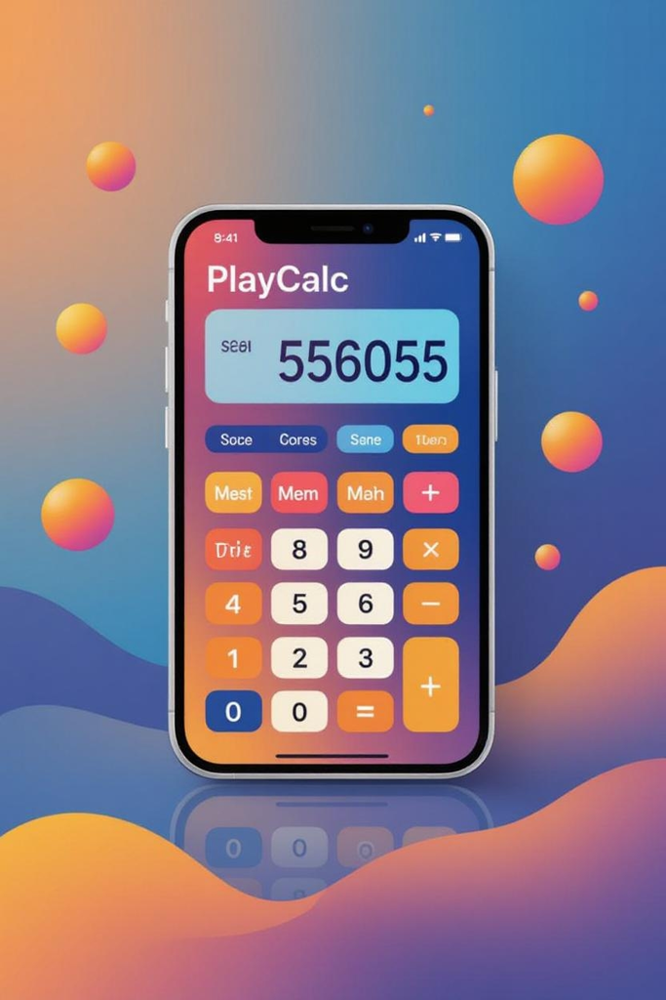

PlayCalc

[](https://docs.expo.dev/)
[](https://reactnative.dev/)
[](LICENSE)
[](https://github.com/your-username/PlayCalc/releases)
[](https://github.com/your-username/PlayCalc/actions)

---

**PlayCalc** is a multifunctional calculator and currency converter app designed to ease daily transaction and calculation stress. Users can save, name, and manage calculation history, perform currency conversions with real-time exchange rates, and access a professional calculator system—all in one app.

---

## Table of Contents
- [Features](#features)
- [Screenshots](#screenshots)
- [Installation](#installation)
- [Usage](#usage)
- [Project Structure](#project-structure)
- [Contact](#contact)
- [License](#license)

---

## Features

### 1. Calculator
- Standard and professional calculations.
- Save calculation history with custom names.
- Search, pin, and access history items for quick recall.
- Export history items to CSV files.
- Double-tap main display to reveal hidden features (like currency conversion).

### 2. Currency Converter
- Real-time currency conversion.
- Currency news for each base currency.
- Search and switch currencies via a modal.
- Currency arithmetic.
- Hidden in main calculator display; revealed via double-tap.

### 3. Professional Calculator
- Advanced calculator functions accessible via display icon.

---

## Screenshots

  
*Splash screen showcasing app logo.*

  
*Animated wave feature in the calculator.*

> Add more screenshots or GIFs of the app here as needed.

---

## Installation

1. Clone the repository:
```bash
git clone https://github.com/your-username/PlayCalc.git
cd PlayCalc

2. Install dependencies:


yarn install
# or
npm install

3. Create a .env file (if needed) for API keys or environment variables:


# Example
API_KEY=your_api_key_here

4. Start the app (Expo):


expo start


---

Usage

Open the app to use the main calculator.

Tap the calculator icon for professional calculations.

Double-tap main display to reveal the currency converter.

Save, search, pin, and export history items.


---

Project Structure

.
├── App.tsx
├── app.config.js
├── assets
├── eas.json
├── package.json
├── src
│   ├── components
│   ├── context
│   ├── data
│   ├── hooks
│   ├── screens
│   └── utils
├── tsconfig.json
└── yarn.lock


---

Contact

WhatsApp: +2349154347487

Facebook: Your Facebook link here

Twitter/X: Your Twitter/X handle here

Website: Your website here

Email: connexa.addis@gmail.com


---

License

© 2025 Connexa. All rights reserved.

This code is publicly viewable but may not be copied, modified, redistributed, or used to create derivative works without explicit written permission from the author.
